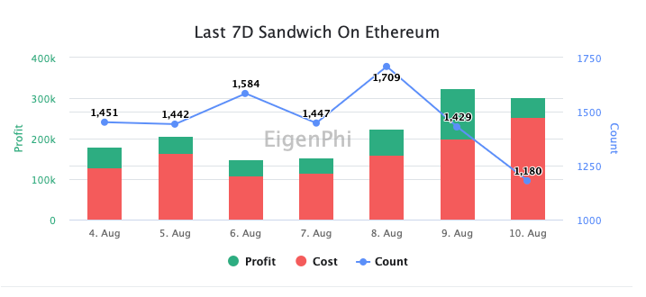

# Sandwich MEV Trends of Last 24 Hours and 7 Days

The first chart of the report shows the profit and Sandwich count trend for the last 24 hrs hour by hour.

.png>)

The stacked columns of each hour indicate the subtotal revenue of MEV that happened during the period, split into profit, the green bar, and cost, the red bar. And the blue line depicts how many Sandwiches happened as the right axis measured them.

We can tell that from 4:00 to 5:00 and 14:00 to 15:00 was the hungriest time for Sandwich searchers.&#x20;

Of course, you can read the exact number of the indicator when you move the cursor to the column and the line.&#x20;

The second chart reveals the hourly trading volume under attack during the last 24 hours.&#x20;

.png>)

The following charts display the trends of the last seven days with the same logic, except for the horizontal axis showing the seven dates.&#x20;

.png>)

What’s the change from reporting date compared to the day before? The following table gives you the answer. It contains the total count, attackers' EOA count, victims' EOA count, total profit/cost/revenue, total ROI, and the same data regarding arbitrages with profit over 1K USD, and MEV-BOT, all of which let you know the changing rate regarding yesterday’s report. &#x20;

.png>)
