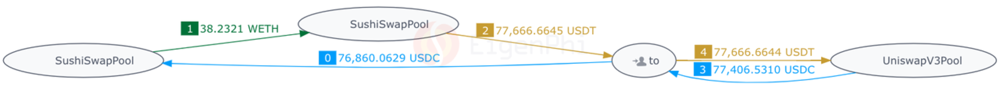

# A Typical Arbitrage Example

A typical Arbitrage example involves 3 tokens and 3 liquidity pools identified by EigenPhi:

* [**Transaction page on EigenPhi**](https://eigenphi.io/mev/ethereum/tx/0xd5b0c82326493690e05c3ac4be63e8bb7763f1a99fbea6db293ec317c8ce5595)
* [**Token Flow and Details on EigenTx**](https://eigenphi.io/mev/eigentx/0xd5b0c82326493690e05c3ac4be63e8bb7763f1a99fbea6db293ec317c8ce5595?allow-different=0\&disable-reverse-debt=0\&hide-inter=0\&rankdir=\&show-net-asset-flow=0)
* [**Transaction page on EtherScan**](https://etherscan.io/tx/0xd5b0c82326493690e05c3ac4be63e8bb7763f1a99fbea6db293ec317c8ce5595)

We use the six steps mentioned earlier to determine whether a transaction is an **Arbitrage**:

**Steps 1 & 2:** Parse the transfers in the transaction and draw a directed graph based on the transfers.

<figure><figcaption>
Example: Directed Graph
</figcaption></figure>

**Step 3:** Identify the strongly connected components in the graph and create a combined transfer table based on it.

The result is that the original graph is the strongly connected components.

<figure><figcaption>
Example: SCC of "Directed Graph"
</figcaption></figure>

Then we can create a combined transfer table based on the graph above.

<table data-header-hidden><thead><tr><th></th><th></th><th width="150"></th><th></th></tr></thead><tbody><tr><td>From</td><td>To</td><td>Asset</td><td>Amount</td></tr><tr><td>MEV Bot 0x80d</td><td>SushiSwap USDC 0x397</td><td>USDC</td><td>76860.06</td></tr><tr><td>SushiSwap USDC 0x397</td><td>SushiSwap USDT 0x06d</td><td>WETH</td><td>38.232</td></tr><tr><td>SushiSwap USDT 0x06d</td><td>MEV Bot 0x80d</td><td>USDT</td><td>77666.66</td></tr><tr><td>Uniswap V3 USDC-USDT 0x785</td><td>MEV Bot 0x80d</td><td>USDC</td><td>77406.53</td></tr><tr><td>MEV Bot 0x80d</td><td>Uniswap V3 USDC-USDT 0x785</td><td>USDT</td><td>77666.66</td></tr></tbody></table>

The TransferTable of the transaction:

<table data-header-hidden><thead><tr><th></th><th width="150"></th><th width="150"></th><th></th></tr></thead><tbody><tr><td></td><td>USDC</td><td>WETH</td><td>USDT</td></tr><tr><td>MEV Bot 0x80d</td><td>-76860.06</td><td></td><td></td></tr><tr><td>SushiSwap USDC 0x397</td><td>+76860.06</td><td></td><td></td></tr><tr><td>SushiSwap USDC 0x397</td><td></td><td>-38.232</td><td></td></tr><tr><td>SushiSwap USDT 0x06d</td><td></td><td>+38.232</td><td></td></tr><tr><td>SushiSwap USDT 0x06d</td><td></td><td></td><td>-77666.66</td></tr><tr><td>MEV Bot 0x80d</td><td></td><td></td><td>+77666.66</td></tr><tr><td>Uniswap V3 USDC-USDT 0x785</td><td>-77406.53</td><td></td><td></td></tr><tr><td>MEV Bot 0x80d</td><td>+77406.53</td><td></td><td></td></tr><tr><td>MEV Bot 0x80d</td><td></td><td></td><td>-77666.66</td></tr><tr><td>Uniswap V3 USDC-USDT 0x785</td><td></td><td></td><td>+77666.66</td></tr></tbody></table>

The resulted CombinedTransferTable:

<table data-header-hidden><thead><tr><th></th><th width="150"></th><th width="150"></th><th width="150"></th><th></th></tr></thead><tbody><tr><td>Address</td><td>USDC</td><td>WETH</td><td>USDT</td><td>Trade?</td></tr><tr><td>SushiSwap USDC 0x397</td><td>76860.06</td><td>-38.232</td><td></td><td>True</td></tr><tr><td>SushiSwap USDT 0x06d</td><td></td><td>38.232</td><td>-77666.66</td><td>True</td></tr><tr><td>Uniswap V3 USDC-USDT 0x785</td><td>-77406.53</td><td></td><td>77666.66</td><td>True</td></tr><tr><td>MEV Bot 0x80d</td><td>546.47</td><td></td><td></td><td>False</td></tr></tbody></table>

**Step 4:** Find the closest point to the **"from"** or **"to"** address of the transaction in the above strongly connected components.

In view that the **"to"** address is already in the graph, the closest point is the **"to"** address itself.

**Steps 5 & 6:** Calculate the profit of the point (Address) in **Step 4**, and determine whether it is positive.

&#x20;                             **(77,406.53 - 76,860.06) USDC + (77,666.66 - 77,666.66) USDT > 0**

Therefore, we identify this transaction as an **Arbitrage**.

.png>)
