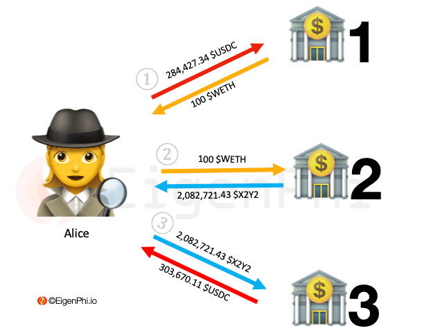

# Arbitrage Involving 3 Tokens Among 3 Trading Venues

Sometimes an arbitrage has to employ three cryptocurrencies that have rates spread among three [liquidity pools](https://eigenphi.io/ethereum/pool/freq) to make a profit. It requires the [searcher](../../users-of-eigenphi/searcher.md) to have the ability to discover the opportunities from rate changes in three liquidity pools. &#x20;

Searcher Alice detects the rate spreads of USDC, WETH, and X2Y2 amid three liquidity pools. Then, she proceeds with the arbitrage as below:&#x20;

1. Alice sells 284,427.34 $USDC for 100 $WETH in a liquidity pool--called LP1--on Uniswap with the exchange rate of 1 $WETH for 2,844.27. $USDC.
2. Alice sells 100 $WETH for 2,082,721.43 $X2Y2 in another liquidity pool--called LP2--on Uniswap with the exchange rate of 1 $WETH for 20,827.21 $X2Y2.&#x20;
3. In another liquidity pool--called LP3, Alice exchanges 2,082,721.43 $X2Y2 for 303,670.11 $USDC.

Alice's revenue from this arbitrage is 19,242.77 $USDC. The cost is the gas fees for the three transactions. Assuming it's 0.05 $WETH, an equivalent of 150 USD at the price of the time. And let's presume the exchange rate of USDC and USD is 1:1. In the end, Alice's profit is 19,092.77 USD.

Next, we will examine the arbitrage requires more tokens and trading venues.

