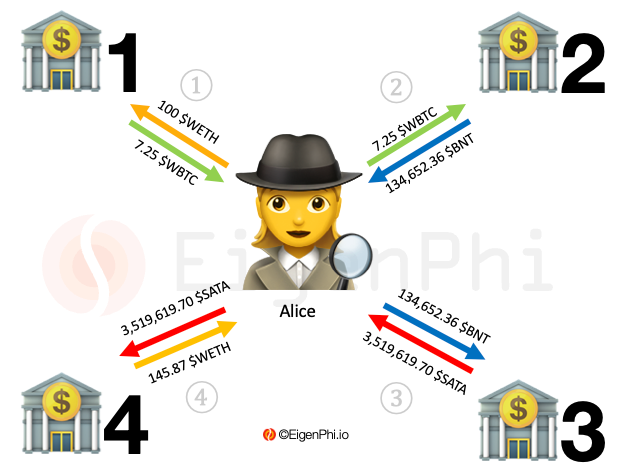

# Arbitrage Requiring More Tokens and More Trading Venues

Certain arbitrage takes advantage of the exchange rates spread among more than three cryptocurrencies founded in over three liquidity pools to make a profit.

Searcher Alice detects the rate spreads of WBTC, WETH, BNT, and SATA amid two UNISWAP liquidity pools and two BANCOR liquidity pools. Then, Alice starts the arbitrage as below:&#x20;

1. Alice sells 100 $WETH for 7.25 $WBTC in a UNISWAP liquidity pool called LP1 with an exchange rate of 1 $WBTC for 13.79 $WETH.&#x20;
2. Alice sells 7.25 $WBTC for 134,652.36 $BNT in a BANCOR liquidity pool called LP2 with an exchange rate of 1 $WBTC for 18,572.74 $BNT.&#x20;
3. In another BANCOR liquidity pool called LP3, Alice exchanged 134,652.36 $BNT for 3,519,619.70 $SATA with an exchange rate of 1 $BNT for 26.14 $SATA.&#x20;
4. In another UNISWAP liquidity pool called LP4, Alice exchanged 3,519,619.70 $SATA for 145.87 $WETH with an exchange rate of 1 $WETH for 24,128.47 $SATA.&#x20;

Alice's revenue from this arbitrage is 45.87 $WETH. The cost is the gas fees for the four transactions. Assuming it's 0.9 $WETH, an equivalent of 2,208 USD at the price of the time. In the end, Alice's profit is 44.97 $WETH worth of 124,117.2 USD.

However, some arbitrages use more than three tokens and trading venues in different ways. It might put several "simple" arbitrages into a big one arbitrage package.&#x20;

 
