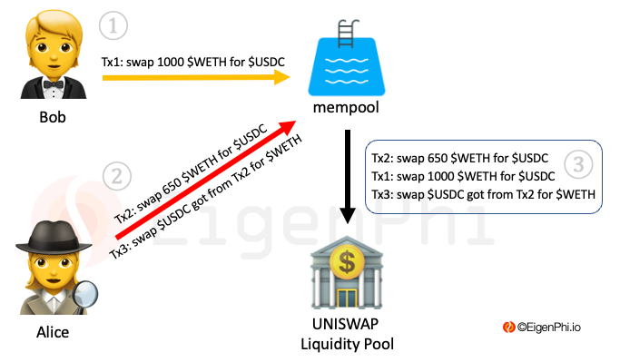

# Sandwich MEV

A sandwich attack involves "sandwiching" the [victim's](https://eigenphi.io/ethereum/sandwich/victim/0xb76a622c7fadbe11c415d141fd7b9eb4b1f414b9) transactions between two transactions initiated by the [searchers](../users-of-eigenphi/searcher.md)/[attackers](https://eigenphi.io/ethereum/sandwich/attacker/0x00000000003b3cc22af3ae1eac0440bcee416b40), whose reordering of the transactions inflicts an implicit loss on the victimized users and possibly benefits the attacker.&#x20;

Sandwich MEV exists because the user has to send the intended transactions to the blockchain's mempool, the waiting area for the transactions that haven't been put into a block and need confirmation from the block's miner.&#x20;

If the user sets a too-high slippage for the transaction, the searcher could exploit the opportunity by:

* Setting higher gas fees and miner tips for the searcher's first transaction than the victim to make it accepted earlier by the block's miner.&#x20;
* Then the searcher would send another transaction with equal or lower gas fees to make sure this transaction is accepted later by the miner than the victim, whose transaction would be squeezed by the attacker's transactions.&#x20;

How exactly does the attacker gain revenues during the process? Here is an example.&#x20;

1. In a UNISWAP liquidity pool, Bob is a retail investor who wants to trade 1000 $WETH for $USDC. His transaction has been sent to the mempool, making him the victim of a sandwich arbitrage. The transaction is marked as ①  in the figure below.&#x20;
2. Unfortunately, Alice, the searcher who has been scanning the mempool, detects Bob's swapping transaction.&#x20;
3. Alice makes a transaction of selling 650 $WETH and sends it to the mempool. In the end, she receives 1,842,200 $USDC at the exchange rate of 1 $WETH for 2,834 $USDC. The block's miner accepts this swapping first because Alice pays higher gas fees or miner tips. The swapping causes the exchange rate to change to 1 $WETH for 2,821 $USDC. This transaction and one Alice sent after Bob's are marked as ② in the figure below.&#x20;
4. Bob's transaction goes through the mempool and to the block selling 1000 $WETH for 2,821,000 $USDC, which he should have been able to get 2,834,000 $USDC.&#x20;
5. Alice's selling of 1,842,200 $USDC passes the mempool and gets recorded by the miner in the block. She receives 652.9 $WETH. &#x20;
6. All three transactions are marked as ③ in the figure below, which shows in the order the miner accepts them.

\
Alice's revenue from this Sandwich arbitrage is 2.9 $WETH. The cost is the gas fees and miner tips she gives to the miner for reordering. Assuming it's 1.2 $WETH. In the end, Alice's profit is 1.7 $WETH.&#x20;

These are the four basic arbitrage types on the transaction and contract levels. But, of course, other kinds of arbitrages also occur on the higher level of blockchain, which we will get to them later.&#x20;

Now we will examine three types of users who are interested in EigenPhi.
