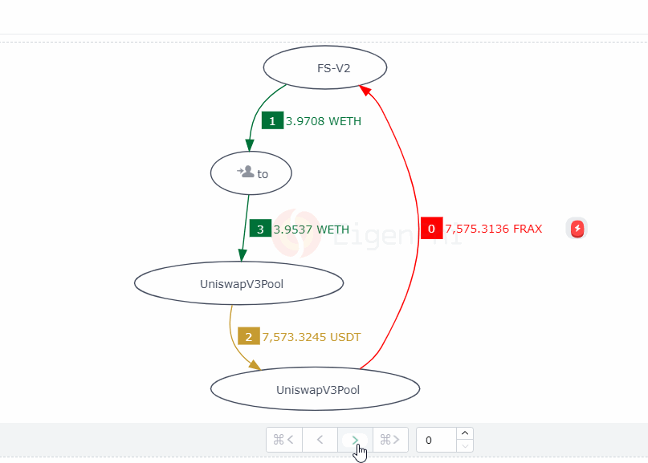

# Navigation Arrows

Below the Token Flow Chart, users can navigate through the Tx themselves by clicking on the arrows. There are 4 navigation arrows in total that each represents the first step, previous step, next step and the last step.&#x20;

<figure><figcaption></figcaption></figure>
