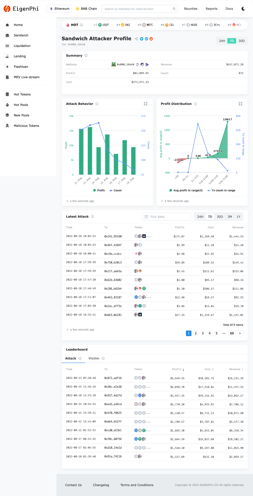
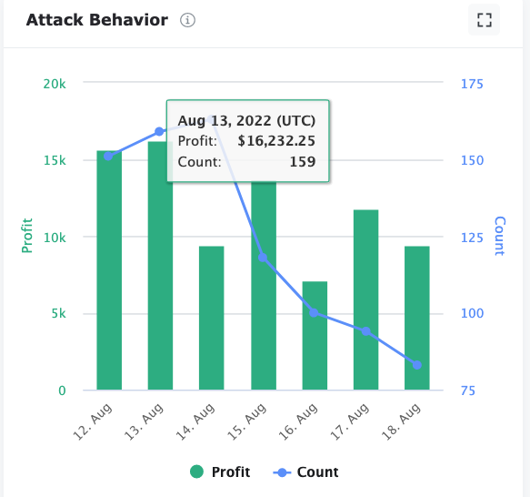

# Attacker detail

**Attacker** detail page focuses on the behavior of a particular Sandwich MEV attacker. Like all the other pages, all the data here are filtered by the chosen time duration, except the **Real-time Attack**.

**Summary** shows the profit, cost, revenue, and the number of attacks this attacker finished. You would find them helpful if you are a researcher.&#x20;

.png>)

**Attack Behavior** figure displays the daily profit and sandwich MEV count by this attacker.&#x20;

**Profit Distribution** illustrates the attacker's performance in another way. In the figure below, this attacker had one MEV losing $235.42.&#x20;

.png>)

**Latest Attack** lists the sandwich MEVs done by this attacker with profit, cost, and revenue. Click the hash address to examine the [token flow of the sandwich attack](../home/universal-search/transaction-profile/liquidation-transaction.md). You can retrospect the old Sandwich MEVs by using the date and the time period selector.&#x20;

.png>)

**Leaderboard** enumerates the top 10 attacks using this contract, ranked by profit, and the top 10 victims who suffered from attacks using this contract, ranked by their losses.&#x20;

Click the data row in the **Attack** tab, and you will be directed to the [details of the Sandwich arbitrage](../home/universal-search/transaction-profile/liquidation-transaction.md). You can also sort them using profit, cost, and revenue.&#x20;

.png>)

The **Victim** tab's data can be sorted by their losses and the count of attacks. A click on the victim address will bring you to the [Victim detail](victim-detail.md) page.&#x20;

.png>)
