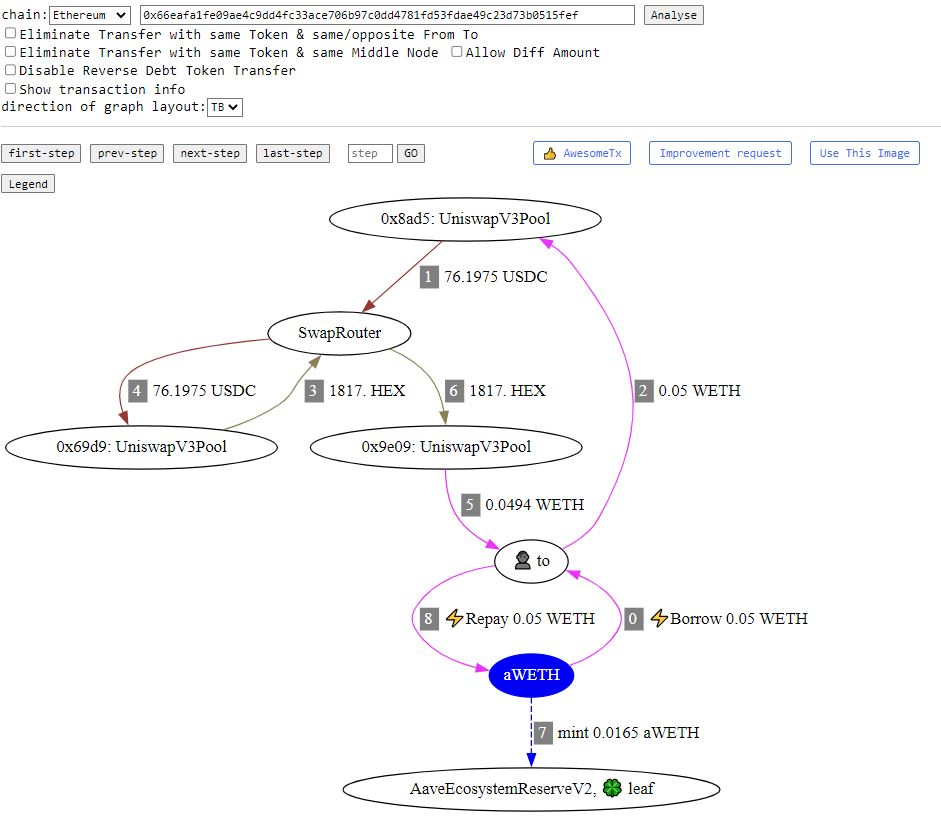
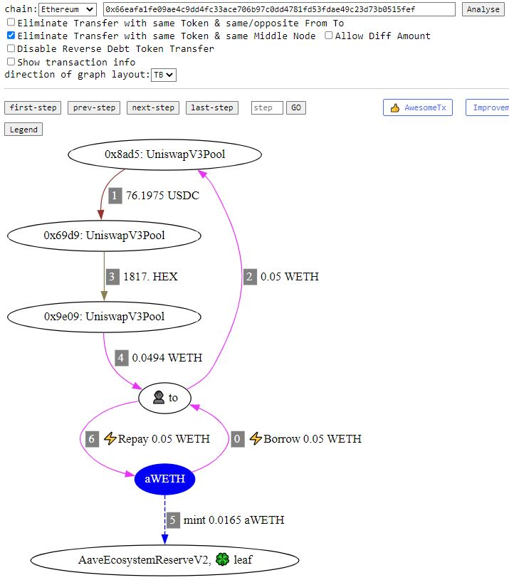

# Eliminate Transfer with same Token & same Middle Node

You may also find that the tokens and amounts that transfer into and out of SwapRouter(middle node) are identical. You could choose to simplify this if it can help with your analysis. You can use the " Eliminate Transfer with same Token & same Middle Node" function.

[**Example**](https://tx.eigenphi.io/analyseTransaction?chain=Ethereum\&tx=0x66eafa1fe09ae4c9dd4fc33ace706b97c0dd4781fd53fdae49c23d73b0515fef\&rankdir=TB)

<figure><figcaption></figcaption></figure>

[**Simplified**](https://tx.eigenphi.io/analyseTransaction?chain=Ethereum\&tx=0x66eafa1fe09ae4c9dd4fc33ace706b97c0dd4781fd53fdae49c23d73b0515fef\&eliminateTransferBySameTokenSameMiddleNode=on\&rankdir=TB) **Version**

<figure><figcaption></figcaption></figure>
