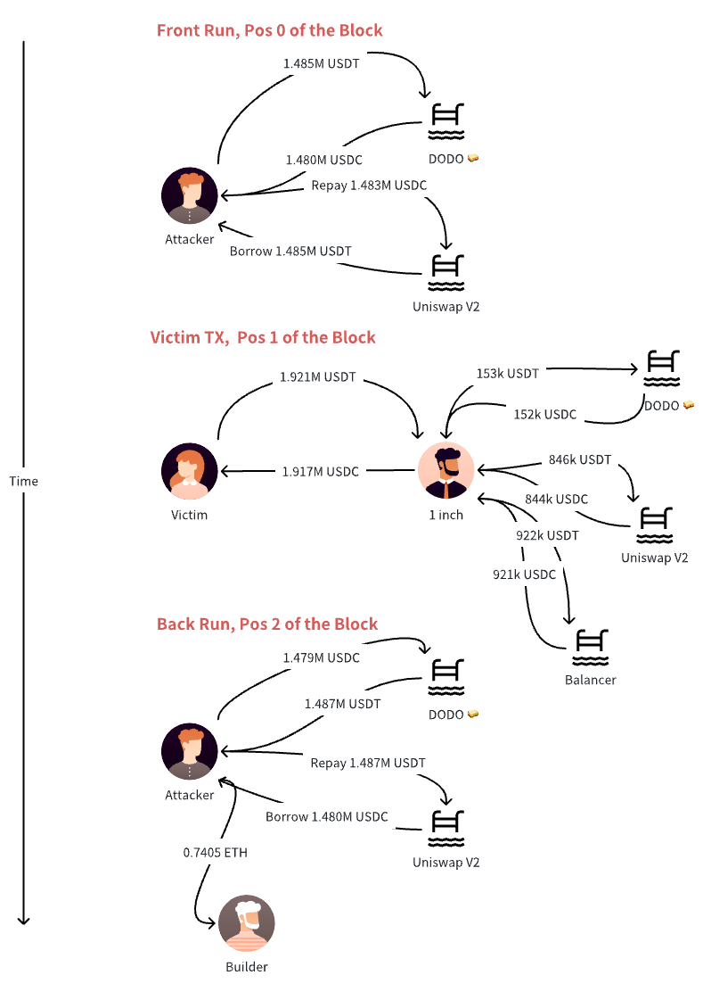

# Combined with Flash Loan, This Leveraged Sandwich Launched the Attack with Millions of Volumes

### Strategy One Liner

By using Uniswap's Flashloan, the attacker was able to launch high-volume sandwich attacks without holding significant assets, resulting in a larger slippage and higher profit.

### Big Picture



<figure><figcaption>
The Frontrun
</figcaption></figure>

<figure><figcaption>
The Victim Transaction
</figcaption></figure>

<figure><figcaption>
The backrun
</figcaption></figure>

### Key Steps

1. Frontrun Step 0: the bot owner sends the contract 0xeae (also the attacker's contract) 3537 USDC, preparing the Flashloan. This 3537 USDC will be used to repay the flash loan.
2. Frontrun Step 1: The bot borrowed 1.485 million USDT from the Uniswap V3 pool through a Flashloan.
3. Frontrun Steps 3,2: The borrowed 1.485 million USDT was then exchanged for 1.480 million USDC in the DODO pool, allowing the bot to frontrun the victim.
4. Frontrun Step 5: The bot utilized the funds from Step 2 along with the extra 3,537 USDC it had set aside during Step 0 to repay the Flash Swap
5. Victim Steps 1,2,4,5,6,7: 1 inch split this big trade into 3, $844k to UniswapV3, $922k to Balancer, and the remaining $153k to DODO. What 1 inch did not know is that the price of USDC at DODO has been manipulated to be higher.
6. Victim Steps 14,15: 1 inch sent all the USDC back to the victim.
7. Backrun Step 1: The bot borrowed 1.480 million USDC from the Uniswap V3 pool through a Flashloan.
8. Backrun Steps 3,2: The bot swapped 1.480 million USDC for 1.487 million USDT in the DODO pool, allowing the bot to back-run the victim and generate profit.
9. Backrun Step 5: The bot repaid the Flash Swap using 1.482 million USDT.
10. Backrun Step 7: The bot sent 0.7405 ETH prepared in Step 0 as a tip to the builder. The builder will put the attacker's bundle in the block with the order untouched in exchange for the builder fee.

**Question:** The victim plans to swap USDT for USDC. Therefore, purchasing USDC in advance to inflate its price forms the cornerstone of the sandwich attack. The attacker's USDT for USDC swap in DODO increases the price of USDC in DODO by approximately 1%. However, a separate swap from USDC to USDT in UniswapV3 will decrease the USDC price—a favorable outcome for the victim. Why does the attacker initiate a USDC for USDT swap at UniswapV3 while simultaneously performing a swap in the opposite direction at DODO? How does this process yield profits? Can you answer this?

This question will be answered in [More Details](combined-with-flash-loan-this-leveraged-sandwich-launched-the-attack-with-millions-of-volumes.md#more-details).

### Key Protocols

1 inch: an exchange aggregator that scans decentralized exchanges to find the lowest cryptocurrency prices for tradersDODO, UniswapV3, Balancer: major DEXs.

### Key Addresses

* The oval marked as "to" in Frontrun is the attacker's asset-managing address.
* The oval "0xeae" in Frontrun is the attacker's attack contract.
* The oval with "DODO"/"UniswapV3"/"1inch"/"Balancer Vault" is DODO/UniswapV3/1inch/Balancer's address. The solid ovals with the same color are the same address.
* The pentagon "from" in the victim transaction is the victim's EOA.
* The pentagon "Builder" is the builder of this block. The builder packages the frontrun-victim-backrun into the block.&#x20;

### Key Assets

USDT, USDC: the top 2 stablecoins anchored to USD

### Simplified Illustration

The DODO pool labeled with 🥪 is where the sandwich happened.

<figure><figcaption></figcaption></figure>

### Step-by-step Decoding

1. Frontrun Step 0: the bot owner sends the contract 0xeae (also the attacker's contract) 3537 USDC, preparing the Flashloan.
2. Frontrun Step 1: The bot borrowed 1.485 million USDT from the Uniswap V3 pool through a Flashloan.
3. Frontrun Steps 3,2: The borrowed 1.485 million USDT was then exchanged for 1.480 million USDC in the DODO pool, allowing the bot to frontrun the victim.
4. Frontrun Step 4: DODO stored the trading fee at its asset-managing address. The fee rate in this example is 0.002%.
5. Frontrun Step 5: The bot utilized the funds from Step 2 along with the extra 3,537 USDC it had set aside during Step 0 to repay the Flash Swap
6. Victim Step 0: The victim sent 1,921,693 USDT to 1 inch, aiming to swap to USDC.
7. Victim Steps 1,2: 1 inch traded $153k at DODO.
8. Victim Step 3: DODO stored the trading fee at its asset-managing address.
9. Victim Steps 4,5: 1 inch traded $845k at UniswapV3.
10. Victim Steps 6-13: 1 inch traded $922k at Balancer.
11. Victim Steps 14,15: 1 inch sent all the USDC back to the victim.
12. Backrun Step 1: The bot borrowed 1.480 million USDC from the Uniswap V3 pool through a Flashloan.
13. Backrun Steps 3,2: The bot swapped 1.480 million USDC for 1.487 million USDT in the DODO pool, allowing the bot to back-run the victim and generate profit.
14. Backrun Step 4: DODO stored the trading fee at its asset-managing address.
15. Backrun Step 5: The bot repaid the Flash Swap using 1.482 million USDT.
16. Backrun Step 6: The bot sent the 4668 USDT to the bot’s asset-managing address (0x000).
17. Backrun Step 7: The bot sent 0.7405 ETH prepared in Step 0 as a tip to the builder.

### More Details

The 3537 USDC in the frontrun step 0 is crucial. Now, we have two DEXs, and the attacker wants to push the state of DEXs in the direction of non-equilibrium. He must inject funds to complete this. In other words, he is buying USDC from DODO at a higher price than Uniswap. So he is doomed to put money in for future profit. The beauty of Flashloan is that, with a principle of only $3.5k, he leveraged $1.4M money. That is a ratio of 400.&#x20;

**The answer to the question in** [**Key Steps**](combined-with-flash-loan-this-leveraged-sandwich-launched-the-attack-with-millions-of-volumes.md#key-steps) **is as follows.** In a nutshell, that is because DODO is much smaller than Uniswap. The attacker's swap (or flash loan) is indeed good for the user. However, he can use the same amount of money he borrowed from Uniswap to create a much higher slippage in DODO. In fact, the price of USDC at DODO gets higher by about 2%, while the price of USDC at Uniswap is only lowered by 0.1%. This is also a fault of 1 inch. Had the portion assigned to DODO much smaller than what happened, this attack would not have happened.

### Keywords

Sandwich attack, Flash loan, Stablecoin
