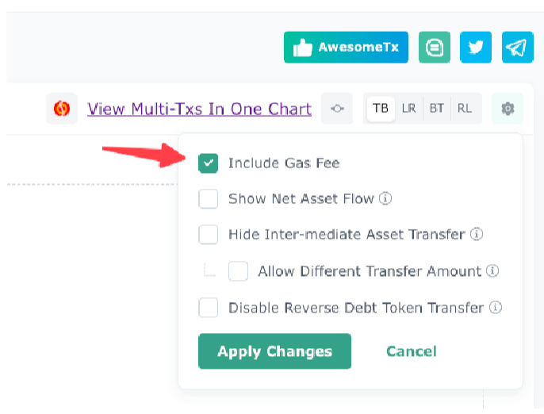

# MEV Blocker, the multi-transaction MEV redistribution system that refunds 90% of builder rewards

### **Strategy One-liner**

A user swapped ICE for STG, which caused an imbalance in price, leading to an arbitrage opportunity between UniswapV3 and SushiSwap. As one of the MEV redistribution mechanisms, MEV Blocker refunds as much as 90% of the builder reward to the one who found the signal.

### Big Picture



Here are the token flow charts for the 3 transactions involved.

<figure><figcaption></figcaption></figure>

### **Key Steps**

1. Tx A, Step 1-2: The user's swapping ICE and WETH in the Uniswap V3 pool caused an imbalance in price difference between this trading venue (UniswapV3 Pool) and a SushiSwap pool, making arbitrage between SushiSwap and UniswapV3 profitable. This is the _signal_ for the back-run, Tx B.
2. Tx B, Step 0, 1, 3: The searcher finished the back-run arbitrage, taking advantage of the above price difference between ICE and WETH.
3. Tx B, Step 5: The searcher paid the builder 0.0161 ETH as builder rewards to let the builder put his back-run arbitrage in the block's top positions.
4. Tx C, Step 0: The builder returned 90% of the builder rewards, 0.014 ETH. This is the refund step, also the goal of the MEV Blocker project.


To view the builder reward payment transfer, you need to check the "Include Gas Fee" option of EigenTx.



### **Key Protocols**

* MEV Blocker: MEV Blocker provides personal protection from frontrunning and sandwich attacks for various Ethereum transactions. It allows users to add the RPC endpoint directly to their wallets, thereby auto-protecting all transactions while trading with DeFi, minting NFTs, or using any dApp.
* 0x Exchange Proxy: The oval marked as "0x Exchange Proxy Flash Wallet" acts as the aggregator that automatically swaps users' assets to intended ones via different trading venues and paths.
* Uniswap: The biggest DEX protocol.
* SushiSwap: Another major DEX protocol.
* Curve: The famous DEX used for swapping stablecoins and other tokens.

### **Key Addresses**

#### In Tx A:

* The pentagon marked as "from", 0x4e8, is the user's EOA.
* "0x Exchange Proxy Flash Wallet" is the aggregator contract
* "UniswapV3Pool" used in step 3 & 4 is the Uniswap V3 Pool trading USDC and WETH, 0x88e6A0c2dDD26FEEb64F039a2c41296FcB3f5640.
* "SwapRouter" used in steps 1 & 4 is Uniswap's router distributing users' assets to different Uniswap trading venues for better liquidity.
* "UniswapV3Pool" used in step 1 & 2 is the Uniswap V3 Pool trading ICE and WETH, 0x36bcF57291a291a6E0E0bFF7B12B69B556BCd9ed.
* "Vyper\_contract" used in steps 5 & 6 is Curve's trading venue.
* "ETH leaf" used in step 8 is the gas fee burning contract.
* "Builder" used in step 9 is builder0x69's EOA.

#### In Tx B:

* "to" contract, 0x5dd, used in steps 1 & 3 is the bot of the searcher.
* "UniswapV3Pool" used in step 0 & 3 is the Uniswap V3 Pool trading ICE and WETH, 0x36bcF57291a291a6E0E0bFF7B12B69B556BCd9ed.
* "SushiSwapPool" used in step 0 & 1 is the SushiSwap Pool trading ICE and WETH, 0x94b86CA6F7a495930Fe7f552eb9e4CbB5eF2b736.
* "leaf" used in step 2 is the searcher's EOA, 0x23812020b27878D5b0efACf6647803701502724f.
* "ETH leaf" used in step 4 is the gas fee burning contract.
* "Builder" used in step 5 is builder0x69's EOA.

#### In Tx C:

* "from Builder 0x690...ac990" is builder0x69's EOA.
* "to leaf 0x4e8...7c8ea" is the user's EOA.

### **Key Assets**

STG, ICE, WETH

### **Simplified Illustration**

<figure><figcaption></figcaption></figure>

### **Step-by-step Decoding**

#### Tx A

<figure><figcaption></figcaption></figure>

Step 0: The user transferred 3,966.4539 ICE to the 0xExchange aggregator.

Step 1 & 2: The Uniswap V3 pool trading ICE and WETH swapped the 3,966.4539 ICE, sent by the 0xExchange aggregator, for 2.3840 WETH, which was sent to the Uniswap's Swap Router.

Step 3 & 4: The Uniswap's Swap Router sent the 2.3840 WETH to the Uniswap V3 pool trading USDC and WETH and swapped out 4,480.7649 USDC, which was sent to the 0xExchange aggregator.

Step 5 & 6: The Curve trading venue swapped 4,480.7649 USDC for 5320.0989 STG and sent the STG back to the 0xExchange aggregator.

Step 7: The 0xExchange aggregator sent 5320.0989 STG back to the user.

Step 8: The gas fee of the transaction was burnt.

Step 9: The user sent the transaction initiation fee to the builder 0x69.

#### Tx B

<figure><figcaption></figcaption></figure>

Step 0: The searcher instructed the Uniswap V3 pool trading ICE and WETH to send 2,091.7021 ICE to the SushiSwap Pool trading ICE and WETH.

Step 1: The SushiSwap Pool trading ICE and WETH sent the swapped-out 1.2687 WETH to the searcher's bot.

Step 2: The searcher's bot sent the back-run revenue to the EOA of the searcher.

Step 3: The searcher's bot sent 1.2471 WETH to the Uniswap V3 pool trading ICE and WETH for the swap.

Step 4: The gas fee of the transaction was burnt.

Step 5: The searcher sent 0.0161 ETH to the builder as builder rewards to thank the builder for putting the back-run right behind the user's swap.


You may have noticed the order from step 1 to step 4 here is not logical in appearance. This represents the "atomicity" feature of Ethereum and other blockchain networks. Atomicity in computing is like a video game level. To level up, you must successfully complete all tasks; if even one task fails, you don't level up. It's an all-or-nothing concept; if any part fails, the entire process fails. You can watch our video for more explanation.


#### Tx C

 

<figure><figcaption></figcaption></figure>

Step 0: The builder refunded 0.014 ETH to the user, following the rule of MEV Blocker. It's 90% of the builder rewards received from the searcher.

Step 1: The gas fee of the transaction was burnt.

### Details

Visit [here](https://eigenphi.io/mev/eigentx/0x9b6c38fa2d335373e86823de1b8c2e4735d47ef304a63fcff796f2f565a9482d,0xd2d1ef1cdaf4010ad2d00564145faa796ebceec33859fac210c39e01fe482b6a,0xe0274c1e473b9eb14f4a3d8f2575afcec99c1c94726f175f3dcdf6aae6890a56?tab=block) to view more details about these 3 transactions.

<figure><figcaption></figcaption></figure>


If you want to find out more transactions involving the same user's EOA, click "transactions Involving From." "transactions Involving To" will show you all the transactions involving the to address, the 0x Exchange Proxy.


It consists of three transactions, leading by the user transaction on position 3, followed by the back-run arbitrage on position 4. In accordance with the agreement, the whitelisted block builder will return a portion of this profit as a rebate to the user who initiated the order flow, happening at position 5.

To put all of these together, you can use the "View Multi-Txs in One Chart" function, helping you get a better idea of the whole picture.

<figure><figcaption></figcaption></figure>

Let's calculate the rebate ratio of this MEV Blocker trade.

In step 5 of Tx B, the searcher paid 0.0161 ETH builder reward to Builder0x69, who built this block. In step 0 of Tx C, Builder0x69 refunded 0.014466 ETH to the user. This yields a fascinating 0.014466 / 0.0161 = 90% MEV rebate ratio!

You can also find out the builder rewards and MEV refunds using Etherscan.

Open[ transaction B's overview page on Etherscan](https://etherscan.io/tx/0xd2d1ef1cdaf4010ad2d00564145faa796ebceec33859fac210c39e01fe482b6a), and you can see that the searcher paid 0.0198 ETH as a transaction fee to the builder, as shown in the "Transaction Fee". This is the cost of this arbitrage for the searcher.

<figure><figcaption></figcaption></figure>

Out of this amount, 0.0037 ETH was the burnt fee, shown in the "Burnt & Txn Saving Fees," matching the step above.

<figure><figcaption></figcaption></figure>

Click [the state tab](https://etherscan.io/tx/0xd2d1ef1cdaf4010ad2d00564145faa796ebceec33859fac210c39e01fe482b6a#statechange), and it shows the builder0x69 received 0.016 ETH as the "State Difference." The 0.0198 ETH corroborates with the transaction fee as the searcher's cost.

<figure><figcaption></figcaption></figure>

Check out [transaction C's "State Difference" on its Etherscan page](https://etherscan.io/tx/0x9b6c38fa2d335373e86823de1b8c2e4735d47ef304a63fcff796f2f565a9482d#statechange); you can see that builder0x69, who built this block, transferred a rebate, 0.014466 ETH, to the user who initiated the first transaction.

<figure><figcaption></figcaption></figure>

It is worth noting that the user only received 0.013987 ETH, which is 0.00047859 ETH less than what the builder transferred. The different amount was the gas fee and was burnt.

<figure><figcaption></figcaption></figure>

### Keywords

MEV redistribution, PBS, MEV Blocker, builder0x69, back-run
