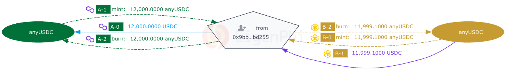

# A Cross-Chain Arbitrage: The Art of Arbitraging BANANA Cross BSC and Polygon Chains

### Strategy One Liner

Using 4 transactions, the bot completed a cross-chain arbitrage between BNB Smart Chain (BSC) and Polygon, swapping BANANA and other cryptos in 2 minutes, and reaped $28 as revenue. [This YouTube video](https://www.youtube.com/watch?v=VLuG_3Qw-SQ) explains the same transaction.

### Big Picture



<figure><figcaption></figcaption></figure>

This graph combines 4 Txs from 2 Chains, Polygon and BSC, into one chart. One can easily identify the corresponding chains by the chain icon tagged with the token flow. The transaction steps are marked in chronological order of occurrence by capital letter dash number.

### Key Steps

Steps A-6: The arbitrager swapped 6000 USDC for 3322.9 BANANA on BSC through an aggregator contract 0xbaf…a9643.

Step B: The arbitrager transferred 3322.9 BANANA to 0x171...319f1 (Anyswap) on BSC.

Step C: The arbitrager received 3322.9 BANANA on Polygon. Steps B and C are the cross-chain transactions. BANANA is transferred from BSC to Polygon in these steps.

Steps D-0,14: The arbitrager swapped 3322.9 BANANA for 6028 USDC through an aggregator contract 0x114…17187.

### Key Protocols

MultiChain (formerly Anyswap): A decentralized cross-chain swap protocol.

ApeSwap: A decentralized exchange (DEX) on multiple chains.

UniswapV2: A major DEX.

Balancer: Another DEX.

### Key Addresses

The pentagon "from 0x9bb...bd255" is the arbitrager's address.

The pentagon "from 0x171...319f1" is Anyswap's address. Because this chart combines multiple transactions together, there may be several "from"s.

The ovals with "APE\_LP" are ApeSwap's Pools. ApeSwap is a multichain DEX. This graph shows its BNB and Polygon Pools.

### Key Assets

BANANA, USDC, WETH, WMATIC, DAI

### Simplified Illustration

The capital letters A-D mark the order of the transactions.

<figure><figcaption></figcaption></figure>

### Step-by-step Decoding

Step A-0: The arbitrager sent 6000 USDC to an aggregator 0xbaf…a9643, aiming to swap for BANANA.

Steps A-1,2: The aggregator swapped 6000 USDC to 6000 BUSD.

Steps A-3-5: The 6000 BUSD was swapped to 3322.9 BANANA.

Step A-6: The arbitrager received 3322.9 BANANA swapped from his 6000 USDC.

Step B: The arbitrager transferred 3322.9 BANANA to 0x171...319f1 (Anyswap) on BSC.

Step C: The arbitrager received 3322.9 BANANA on Polygon. Steps B and C are the cross-chain transactions. BANANA is transferred from BSC to Polygon in these steps.

Step D-0: The arbitrager sent 3322.9 BANANA to an aggregator 0x114…17187, aiming to swap back to USDC.

Steps D-1 to D-5: The arbitrage used the aggregator to swap BANANA to WETH, then to DAI then to USDC.

Steps D-6 to D-13: First, swap BANANA to WMATIC, then to USDC.

Step D-14: Sent all the USDCs swapped from D-1 to D-13 back to the arbitrager. That is a total of 6028 USDC.

### More Details

The bot gained revenue of 28.4604 USDC on Polygon. The entire cross-chain arbitrage process took about 2 minutes, and the total gas cost was about $1.35.

Because the assets are moved from one chain to another in the cross-chain arbitrage, the bot would occasionally rebalance assets on these two chains, as shown in the following graph.

<figure><figcaption></figcaption></figure>


